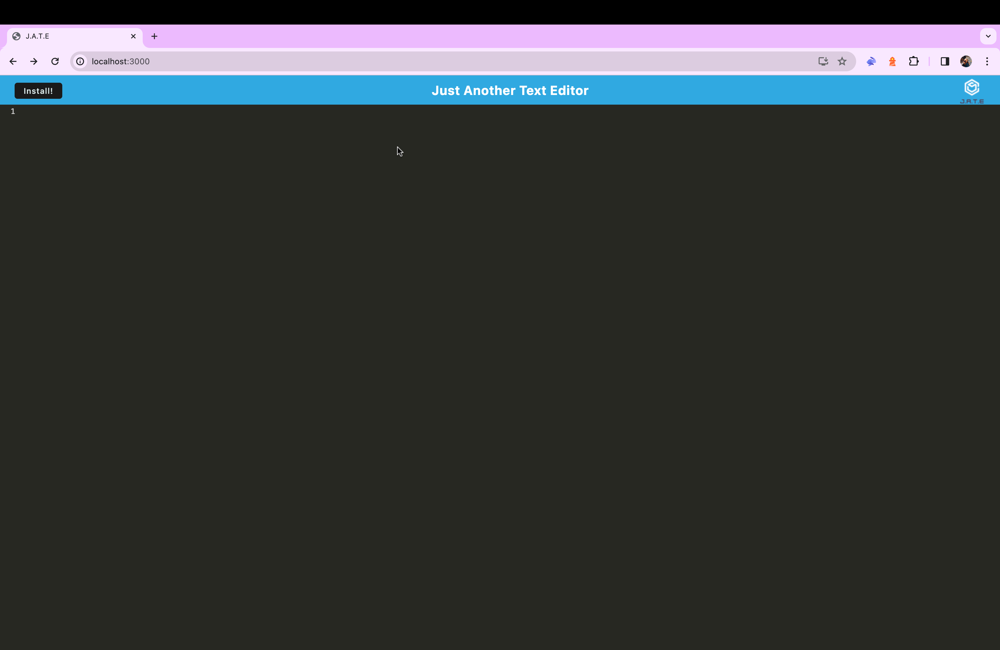
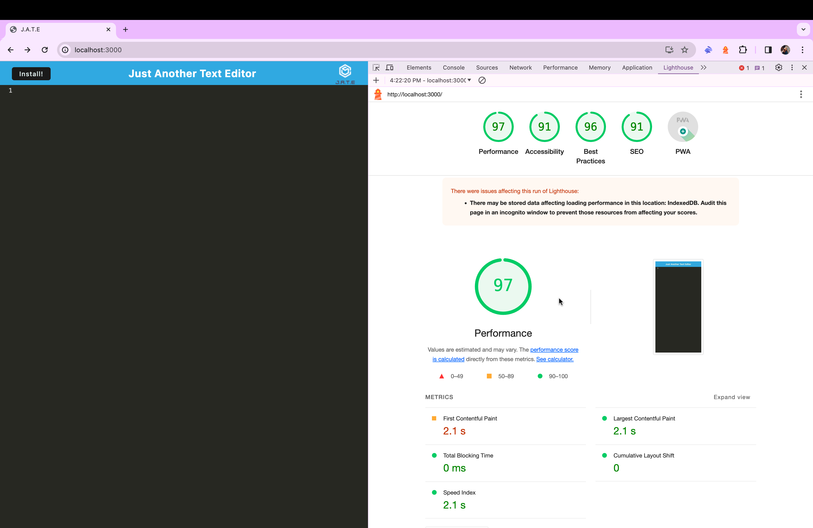

# Challenge 15 - J.A.T.E. Just Another Text Editor
 

## Description
This is a single-paged web application that meets the PWA requirements, meaning J.A.T.E. or Just Another Text Editor is installable and can be used offline. You can use J.A.T.E. as a coding notebook to write blocks of code you want to remember or practice syntax! This application was made using JavaScript, HTML, CSS, webpack.js, node, and other packages

## Table of Contents 
- [Usage](#usage)

- [Credits](#credits)

- [Questions](#questions)

- [License](#license)

## Images/Videos/Links
**This is what the text editor looks like in the browser:**

**This is the Lighthouse PWA Report on the application:**

## Usage 
To use this application go to the deployed website [here](), once you're there you can just use the application in your browser or you can click 'Install!' button in the top left corner on the browser and install the application following the steps in your browser.

## Credits
- [npm](https://www.npmjs.com/)
- [babel](https://babeljs.io/)
- [webpack.js](https://webpack.js.org/)
- [node.js](https://nodejs.org/en)

## Questions
If you have any questions/comments about the project, you can email me at [aleahwhite55@gmail.com](mailto:aleahwhite55@gmail.com). For more of my work you can visit my GitHub at [aleahwhite](https://github.com/aleahwhite)!

## License
This project is licensed under the MIT license. For more information, see the [license page](https://spdx.org/licenses/MIT.html).